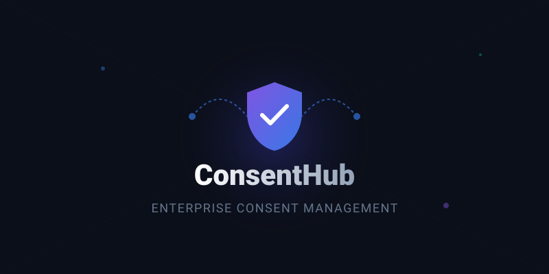
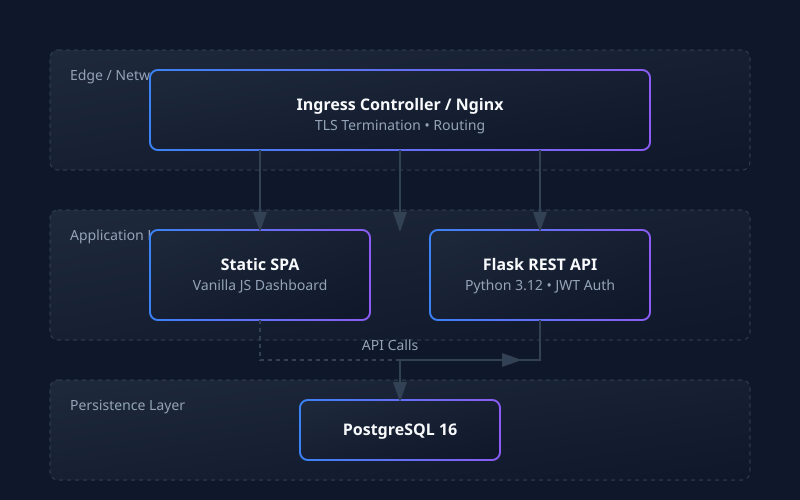
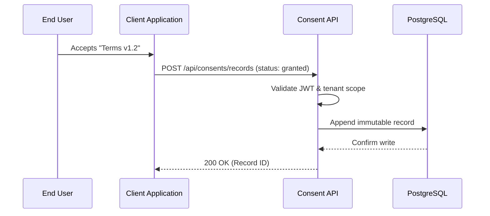

<div align="center">
  

  <p align="center">
    <strong>Production-ready B2B SaaS platform for managing consent policies and absolute auditability.</strong>
  </p>

  <p align="center">
    <a href="https://github.com/DARREN-2000/B2B_Consent_Personalization/actions/workflows/ci.yml"></a>
    <a href="https://darren-2000.github.io/B2B_Consent_Personalization/"></a>
    <a href="https://opensource.org/licenses/MIT"></a>
    <a href="https://www.python.org/"></a>
  </p>

  <p align="center">
    <a href="https://darren-2000.github.io/B2B_Consent_Personalization/"><strong>Explore the Docs »</strong></a>
    <br />
    <br />
    <a href="#quick-start">Quick Start</a>
    ·
    <a href="#core-features">Features</a>
    ·
    <a href="https://github.com/DARREN-2000/B2B_Consent_Personalization/issues">Report Bug</a>
    ·
    <a href="https://github.com/DARREN-2000/B2B_Consent_Personalization/issues">Request Feature</a>
  </p>
</div>

---

## 🚀 Why ConsentHub?

Managing data-subject consent in an increasingly regulated environment (GDPR, CCPA, LGPD) is complex and fraught with risk. Traditional platforms are either excessively heavyweight, designed only for enterprise marketing teams, or lack developer-friendly primitives.

**ConsentHub strikes the balance.** It provides a highly performant, stateless API designed to integrate natively into your existing B2B architecture, coupled with a seamless administrative dashboard.

It guarantees **multi-tenant data isolation**, **immutable audit trails**, and **horizontal scalability** out of the box.

---

## ✨ Core Features

| Capability | Description |
|---|---|
| **Immutable Audit Logs** | Every grant, denial, and withdrawal is recorded immutably with timestamp and context. |
| **Strict Multi-tenancy** | Organization-scoped data isolation enforced deeply at the ORM layer. |
| **Dynamic Policies** | Model GDPR, CCPA, LGPD, or custom consent frameworks with version control. |
| **Role-Based Access** | Granular access control via JWTs (`admin`, `editor`, `viewer`). |
| **Zero-Build UI** | A blazingly fast Vanilla JS dashboard served efficiently via Nginx. |
| **Cloud-Native Edge** | Production-ready Helm charts and Docker multi-stage builds. |

---

## 🏗️ Architecture Overview

ConsentHub is designed around a three-tier, cloud-native architecture that separates the edge routing, the stateless application logic, and the persistent data store.

<div align="center">
  
</div>

### Data Flow



---

## ⚡ Quick Start

### 1. The 30-Second Demo Mode (No DB required)

Experience the platform instantly using our containerized Demo Mode (powered by an internal SQLite instance).

```bash
git clone https://github.com/DARREN-2000/B2B_Consent_Personalization.git
cd B2B_Consent_Personalization

make demo
```
Navigate to `http://localhost:3000`.

### 2. Production Docker Compose

For a standard deployment utilizing PostgreSQL:

```bash
# 1. Configure your environment secrets
cp .env.example .env

# 2. Start the full stack
docker-compose up --build -d
```

### 3. Bootstrap an Administrator

Create your first organizational admin user to access the dashboard:

```bash
curl -X POST http://localhost:5000/api/auth/register \
  -H "Content-Type: application/json" \
  -d '{
    "email": "admin@yourcompany.com",
    "name": "Admin User",
    "password": "SecurePass123!",
    "organization_id": "YOUR-ORG-UUID",
    "role": "admin"
  }'
```

---

## 📚 Documentation

Comprehensive documentation is available in the `docs/` directory and hosted online via GitHub Pages.

- **[Getting Started](docs/getting-started.md)**: Onboarding and initial setup.
- **[Installation](docs/installation.md)**: Detailed Docker and Kubernetes setup.
- **[Architecture & Design](docs/architecture.md)**: Deep dives into the system internals and data models.
- **[API Reference](docs/api.md)**: Exhaustive endpoints documentation.
- **[Deployment](docs/deployment.md)**: Strategies for running ConsentHub in production.

---

## 🛡️ Enterprise Readiness

ConsentHub is built to operate reliably in heavily scrutinized environments.

- **Security:** We take security seriously. Please review our [Security Policy](SECURITY.md) for vulnerability reporting.
- **Scale:** Stateless API design ensures linear scalability via Kubernetes HPA.
- **Lineage:** Every record maps precisely back to the method, timestamp, and policy version it was generated under.

---

## 🤝 Contributing

We welcome contributions of all sizes! Whether it's a typo fix, a new API endpoint, or an integration guide, your help makes ConsentHub better.

Please read our [Contributing Guide](CONTRIBUTING.md) and [Code of Conduct](CODE_OF_CONDUCT.md) before submitting a Pull Request.

---

## 📜 License

This project is licensed under the MIT License - see the [LICENSE](LICENSE) file for details.

<div align="center">
  <sub>Built with precision for enterprise developers.</sub>
</div>