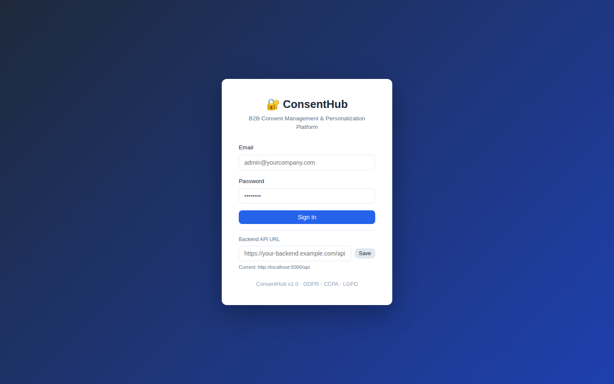
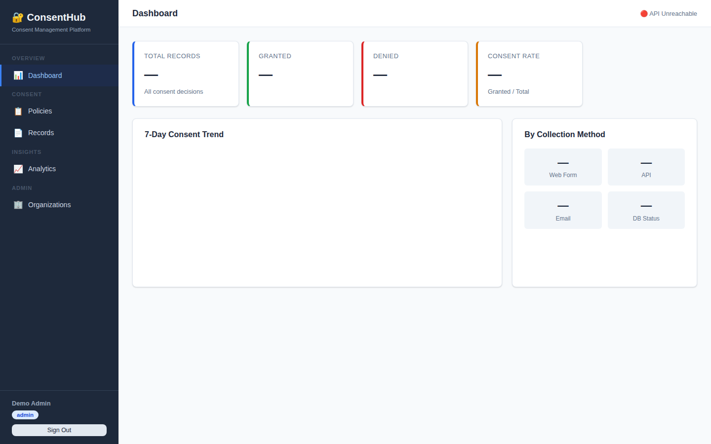
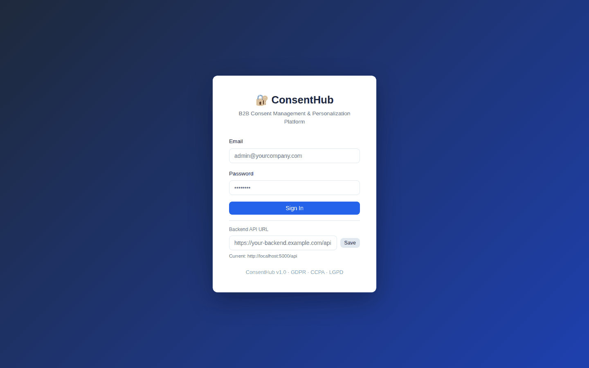
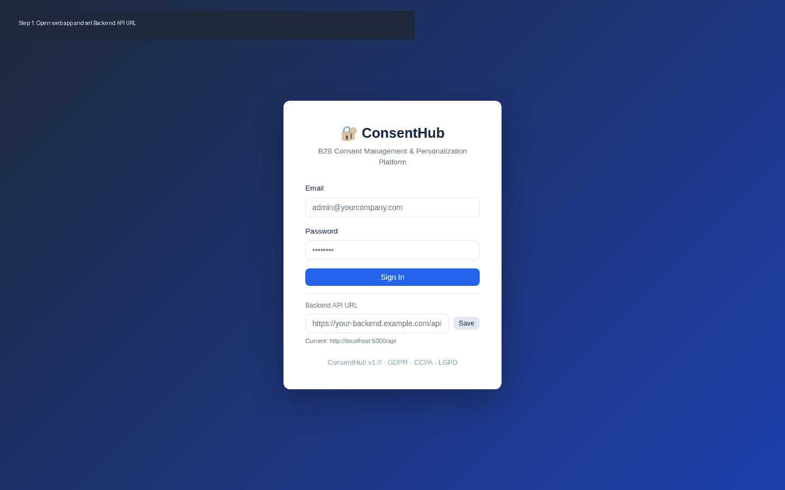

# ConsentHub — B2B Consent Management & Personalization Platform

> Production-focused consent management platform with Flask API, RBAC, analytics, export, and a static admin dashboard.

[](https://github.com/DARREN-2000/B2B_Consent_Personalization/actions/workflows/ci.yml)
[](https://github.com/DARREN-2000/B2B_Consent_Personalization/actions/workflows/pages/pages-build-deployment)

---

## ✅ Can you start the web app right now?

**Yes.**

### Local run (verified)

```bash
cp .env.example .env
docker compose up -d --build
```

Then open:
- Frontend: `http://localhost:3000`
- Backend health: `http://localhost:5000/api/health`

### Verification commands

```bash
curl -s http://localhost:5000/api/health
curl -I http://localhost:3000
```

Expected:
- backend health JSON with `"status":"healthy"`
- frontend HTTP `200 OK`

---

## 🚀 Deployment status

### GitHub Pages

- Workflow for Pages deployment exists: `.github/workflows/pages.yml`
- It deploys `frontend/src` to Pages on push to `main`.
- Runtime API endpoint is configurable from the login page (or `?api_url=...`).

### Is it deployed publicly right now?

- A Pages deployment pipeline is configured and active.
- In this task environment, external DNS resolution to `*.github.io` was unavailable, so direct public reachability could not be re-validated from here.
- The app is **confirmed runnable locally** and **ready for Pages deployment after merge to `main`**.

Hosted URL pattern:

```text
https://<owner>.github.io/B2B_Consent_Personalization/
```

### Deployment notes

- On localhost, the frontend defaults to `http://localhost:5000/api` for developer convenience only.
- For hosted deployments (Pages/custom domain), set an HTTPS backend API URL in the login screen.
- Pages uses `index.html` as `404.html` for SPA route fallback; this favors client-side routing over strict static 404 behavior.

---

## 🏗️ Architecture

- **Frontend**: Static SPA (HTML/CSS/Vanilla JS + Chart.js)
- **Backend**: Flask + SQLAlchemy + JWT
- **DB**: PostgreSQL (SQLite fallback for dev)
- **Infra**: Docker Compose, Helm, Kubernetes
- **CI/CD**: GitHub Actions (test/build/lint/deploy)

See:
- [`docs/ARCHITECTURE.md`](docs/ARCHITECTURE.md)
- [`docs/DEPLOYMENT.md`](docs/DEPLOYMENT.md)
- [`docs/API.md`](docs/API.md)
- [`docs/PRODUCTION_GAPS.md`](docs/PRODUCTION_GAPS.md)

---

## ✨ Core capabilities

- Multi-tenant consent policy and consent record management
- JWT auth (access + refresh)
- RBAC (`admin`, `editor`, `viewer`)
- Consent analytics + trend endpoints
- CSV/JSON export
- Dockerized backend/frontend
- Helm chart for Kubernetes deployment

---

## 📸 Screenshots

### Login + API endpoint configuration



### Dashboard shell



---

## 🎬 Short demo clips

> GIF clips are included for lightweight in-repo viewing.

- App flow (login → dashboard):



- Quick setup demo:



---

## ⚙️ Quick start

### 1) Clone and configure

```bash
git clone https://github.com/DARREN-2000/B2B_Consent_Personalization.git
cd B2B_Consent_Personalization
cp .env.example .env
```

### 2) Start stack

```bash
docker compose up -d --build
```

### 3) Open app

- `http://localhost:3000`

### 4) (Optional) GitHub Pages frontend

1. Ensure repo Pages source is **GitHub Actions**.
2. Merge to `main` (or run workflow manually).
3. Open: `https://<owner>.github.io/B2B_Consent_Personalization/`
4. Set **Backend API URL** in login screen (example: `https://api.yourdomain.com/api`).

Or bootstrap with query param:

```text
https://<owner>.github.io/B2B_Consent_Personalization/?api_url=https://api.yourdomain.com/api
```

---

## 🧪 Quality checks

```bash
# backend tests
cd backend
PYTHONPATH=. pytest --cov=app --cov-report=term-missing

# helm lint
cd ..
helm lint helm/consenthub

# frontend image build
docker build -t consenthub/frontend:ci ./frontend
```

---

## 🔒 Production hardening checklist

- [ ] Set strong secrets (`SECRET_KEY`, `JWT_SECRET_KEY`, `ADMIN_API_KEY`)
- [ ] Replace wildcard CORS with allowlist
- [ ] Enforce HTTPS/TLS at ingress
- [ ] Add centralized logging and alerting
- [ ] Add backup/restore drills for PostgreSQL
- [ ] Add load/performance test budget in CI
- [ ] Add SAST/Dependency/Container scanning gates
- [ ] Add release tagging + immutable deployment strategy

Detailed gap analysis and priorities:

➡️ [`docs/PRODUCTION_GAPS.md`](docs/PRODUCTION_GAPS.md)

---

## 📄 License

MIT — see [`LICENSE`](LICENSE)
