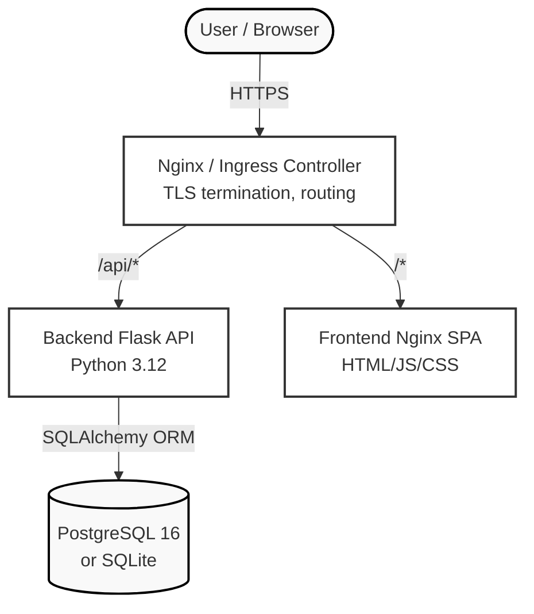
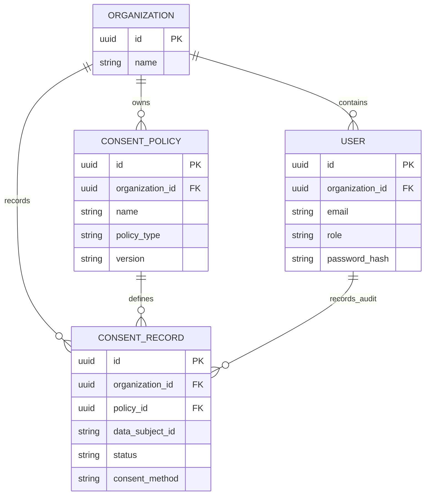

# Architecture Overview

ConsentHub employs a robust, scalable multi-tier architecture suitable for enterprise B2B SaaS deployments.

## System Diagram

The system operates across three primary layers: the Edge/Frontend, the Application API, and the Persistence Layer.

## Data Models

The data model strictly enforces multi-tenant isolation through an Organization-scoped hierarchy.

## Request Lifecycle

1. **Authentication:** The `POST /api/auth/login` endpoint validates credentials using bcrypt and issues JWT access and refresh tokens.
2. **Authorization & JWT Validation:** Protected endpoints require a valid `Authorization: Bearer <token>` header. `Flask-JWT-Extended` decodes the token, exposing claims like `user_id`, `role`, and `organization_id`.
3. **Role-Based Guard:** The `require_role()` decorator intercepts the request, ensuring the user possesses the necessary privileges (`admin`, `editor`, or `viewer`).
4. **Tenant Isolation:** SQLAlchemy queries are implicitly or explicitly scoped to the user's `organization_id`, ensuring absolute data segregation between tenants.
5. **Execution & Audit:** State-modifying requests create or update records. Consent records immutably capture context (method, timestamp) to fulfill compliance audit requirements.

## Scalability and Performance

- **Stateless Application Layer:** The Flask API maintains zero local state between requests, allowing horizontal scaling using Kubernetes Horizontal Pod Autoscaler (HPA).
- **Database Pooling:** SQLAlchemy manages connection pooling to optimize PostgreSQL throughput.
- **Production Edge:** Nginx handles TLS termination and serves the static Single Page Application (SPA), completely decoupling the UI load from the API layer.
